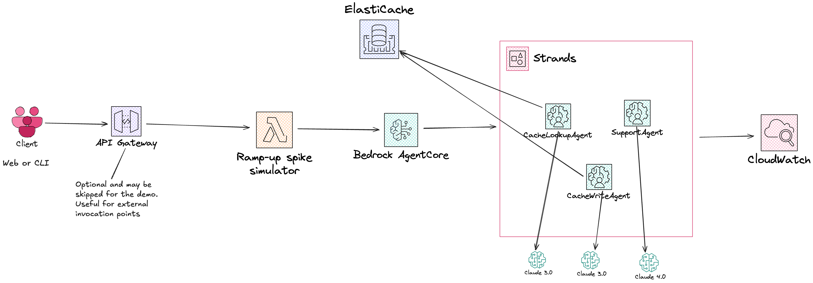

# Semantic Support Desk for Cloud Outages

## Scenario

During a major AWS regional event (e.g. a race condition in DNS management for DynamoDB service), thousands of AWS customers - each with workloads in the affected regoin - simultaneously open support chats. Despite their described symptoms differing ("EC2 is timing out", "deployment failed", "is AWS down"), they refer to the same underlying issue.
This creates a [thundering herd incident](https://en.wikipedia.org/wiki/Thundering_herd_problem)
for AWS support...

All customers want to know **(1)** what's happening, **(2)** if it is a known AWS incident,
and **(3)** what mitigation steps exist.

This presentation aims to demonstrate how the support can leverage
**Bedrock AgentCore + Strands** with **semantic caching** to dramatically reduce response latency and cost during such incidents.

### What does this scenario bring?

- **Outages** = huge simultaneous spikes of similar queries
- **Stable answers**: _Known issue in us-east-1, AWS investigating, workraround: retry after 5 minutes"_ is valid for minutes or even hours
- Opportunity to showcase a **multi-agent scenario in AWS landscape**
- **Semantic caching** relevance. Same intent phrased differently
- **ROI clarity** - show cache hit ratios rising over time, and latency dropping from seconds to milliseconds
- **Relatable** - re:Invent attendees have likely lived through AWS regional hiccups
- **Fast turnaround** - minimal code required
- **Non-sensitive**. No user PII, PFI or PHI used in the demo

## Architecture

### Diagram

### Flow

1. **Client** initiates request burns (parametrizable), e.g. `POST /simulate?cache=true`
2. **API Gateway** routes to **Simulate Demo Spike (Lambda)**. Gradually increases request throughput, e.g.: start with 1 user/second and ramp to 100 users/second over 30 seconds
3. For each request **Bedrock AgentCore** is invoked. Payload includes `cache_enabled` flag
4. **Bedrock AgentCore** dispatches to **CacheLookupAgent** (Claude 3.0). Uses **Titan** embeddings to generate semantic vector for the query
5. **CacheLookupAgent** queries **ElastiCache (Valkey)** for near-duplicate embeddings:

- ✅ if **cache hit**, return cached response to **AgentCore**
- ❌ if **cache miss**, forward to **SupportAgent**

6. On cache miss, **SupportAgent** (Claude 4.0) analyzes the issue. Generates structured response or recommended fix
7. **SupportAgent** passes response to **CacheWriteAgent**. The latter writes results and embeddings back to **ElastiCache**
8. **BedrockAgentCore** aggregates results and returns to the client simulator
9. **Lambda** logs and emits to **CloudWatch**:

- latency per call
- Bedrock token cost estimate
- cache hit/miss ratio

10. **CloudWatch Dashboard** visualizes:

- Average latency drop
- Bedrock cost savings
- Cache efficiency
- Request volume over time

11. **(Optional)** Operator triggers **CacheReset Lambda** to clear cache (`FLUSHALL`) for the next run

If time **and budget** allow, it would make our case stronger if we could replay the demo with `cache=false` - to leverage path that would skip completely caching.
